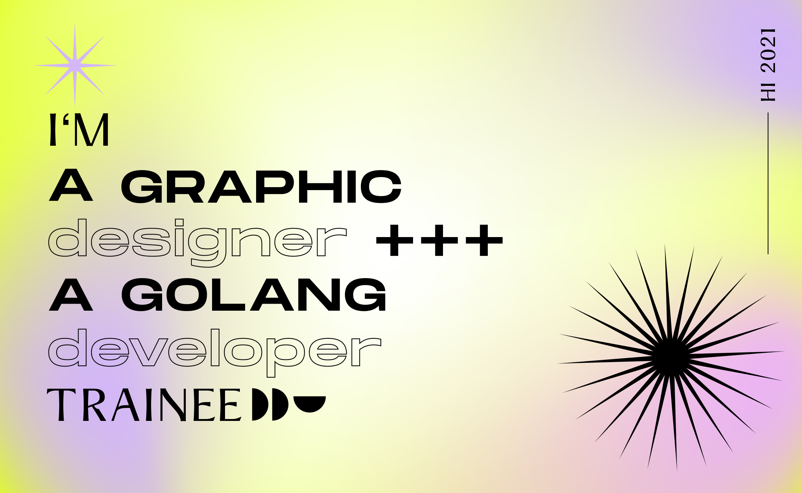

## Mi dia a dia :gem:

 ⚙️ Actualmente estoy trabajando en .go, .ts, .html, .sql, .psd, .ai
 
 🌱 Actualmente estoy aprendiendo GO, Angular, Docker
 
 🤔 Estoy buscando colaborar en proyectos de diversidad de género e inclusión
 
 ⚡ Fun fact: Me gusta escribir, mirar proyectos en Behance y las plantas
 

## Lo que disfruto hacer :green_book:

[Botti](https://medium.com/@guadastoop/botti-mi-humilde-aplicaci%C3%B3n-de-slack-hecha-en-java-97f122d8c07)

[Diseño de servicios](https://www.behance.net/gallery/84224841/Proyecto-de-Graducacion-Diseno-de-servicios)

## Encontrame en 

